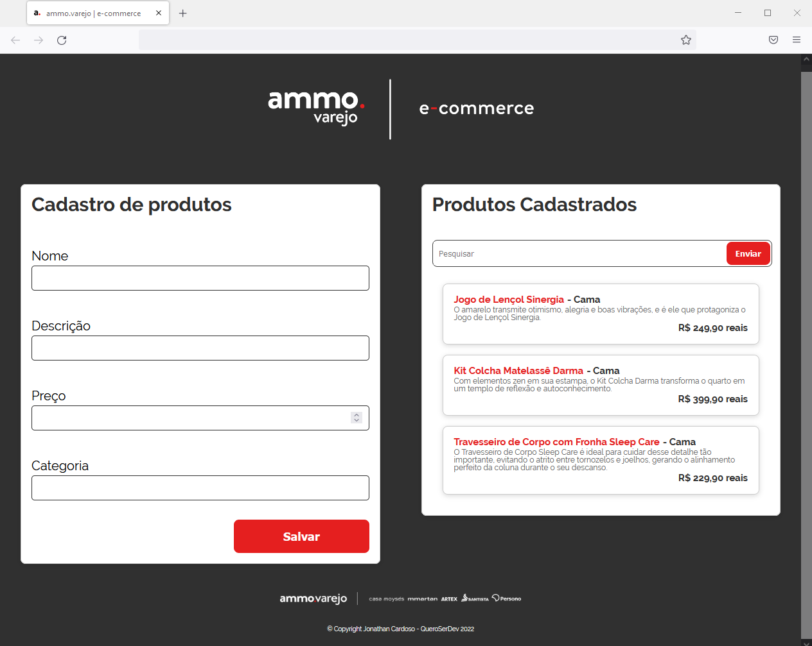

<h1>
    
</h1>

# Olá!

Olá, eu sou o Jonathan e seja bem-vindo(a) a minha primeira aplicação! Estou muito feliz em postar esse projeto e espero que ele te atenda de alguma forma! Todo o feedback é bem-vindo!


## 🔖&nbsp; Sobre

Esse projeto **ammo varejo | e-commerce** foi criado a partir de uma iniciativa da empresa **ammo varejo** com o programa **#QueroSerDev**  com o intuito de formar e capacitar os seus colaboradores que tinha o interesse a serem Devs. Assim deram esse desafio de criar uma aplicação de cadastro, listagem e busca de produtos de um e-commerce, para por em prática todo conteúdo estudado durante o programa.

---

## 🚀 Código e Bibliotecas

Para esse projeto foi usado HTML, CSS e JS, e as bibliotecas body-parser, cors, express, nodemon, mysql2, patch, sequelize e sequelize-cli.

---

## 🗂 Como baixar o projeto

```bash
    # Clonar o repositório
    $ git clone https://github.com/jowcardoso/projeto-desafio-QueroSerDev
    # Entrar no diretório
    $ cd projeto-desafio-QueroSerDev
    # Instalar as dependências
    $ npm install
    # Iniciar o banco de dados
    $ npm run start
    # Como configurar a conexão do banco de dados?
    Abra o arquivo config.json na pasta ./api/config/ e configure com seu dialeto, usuario, senha e host.
    # Como criar o database produtos_ecommerce?
    Entre no seu terminal SQL e dê o comando para criar sua database produtos_ecommerce, deixando o mesmo nome no seu database no seu arquivo config.json.
    # Criando modelo do database
    $ npx sequelize-cli model:create -- name Produtos --attributes nome:string,descricao:string,categoria:string,preco:decimal
    # Como rodar as migrations?
    $ npx sequelize-cli db:migrate
    # Como acessar a aplicação?
    Abra o arquivo index.html no seu navegador web.
```

---

Desenvolvido por Jonathan Cardoso - QueroSerDev 2022
